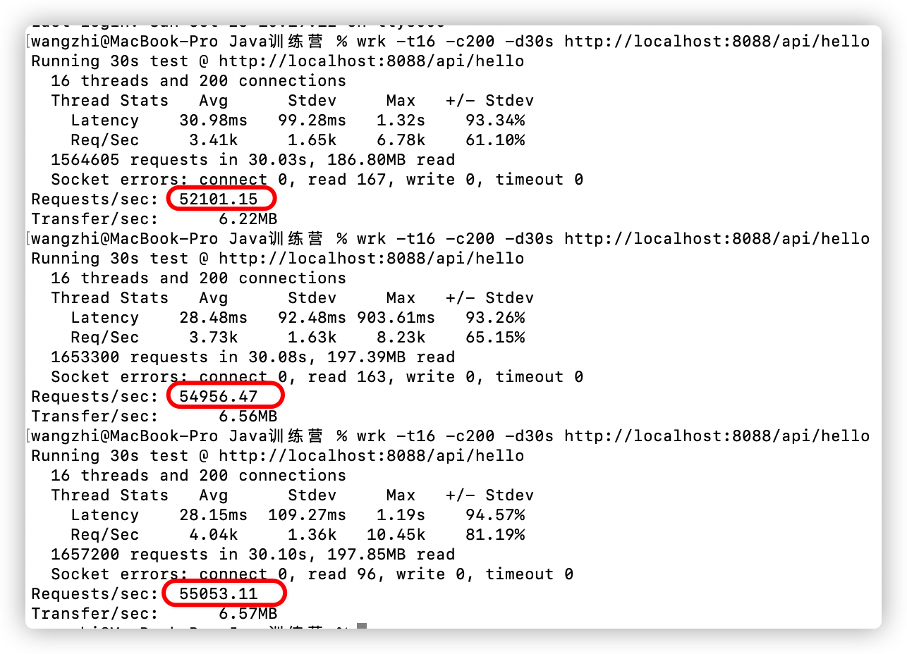

### 学习笔记

不得不说的话，先吐槽的下自己的水平，太丢人了，自己水平有点低了，怎么说。。。。。

说下自己的环境：mac笔记本，jdk用的14，进入正题：

1. 编译出现问题：错误: 编码 UTF-8 的不可映射字符 (0xD1)，然后添加了-encoding utf-8，还是不行，服了。然后只能改源码，先使用文本编辑工具打开，
然后复制一下，再使用idea打开，可以看到乱码了，复制进去就好，编译通过。
2. 运行：java -XX:+PrintGCDetails -XX:+PrintGCDateStamps GCLogAnalysis，出现Unrecognized VM option 'PrintGCDateStamps'，看来
应该是不支持，想查一下java可支持的-XX参数，然后百度没找到结果，那就先把这个参数删了，咱们继续往下。
3. 简单点，直接java -XX:+PrintGCDetails GCLogAnalysis.java，ok了，没问题，Java14默认使用的是G1垃圾收集器，但这个命令有个警告：
[warning][gc] -XX:+PrintGCDetails is deprecated. Will use -Xlog:gc* instead，暂时追求完美的人，警告能不管，解决，继续。
4. 解决警告：java -Xlog:gc* GCLogAnalysis，然后报错了：zsh: no matches found: -Xlog:gc*，无语啊，百度解决，对操作系统不熟悉，解决：
vim ~/.zshrc，添加setopt no_nomatch，重新加载source ~/.zshrc，ok可以了。
5. 继续向下，得打印到文件里面了，java -Xloggc:gc.demo.log -Xlog:gc* GCLogAnalysis，没报错，但是警告又来了：
[warning][gc] -Xloggc is deprecated. Will use -Xlog:gc:gc.demo.log instead，改呗，java -Xlog:gc:gc.demo.log -XX:+PrintGCDetails GCLogAnalysis，
终于ok了。
6. 好不容易成功了，咱们打开文件看看，不对呀，怎么这么点日志，感觉哪块不对，和老师演示的完全不一样呀，老师演示的时候打印到文件里面的时候控制台就没有日志信息了，
为啥我这还是一堆，仔细看看，原来文件里面只打印了主要信息，使用的什么垃圾收集器，发生了多少次GC，总共花的时间，而命令行的日志更加详细，打印的是每个空间的
变化，垃圾回收的每一步都很详细，那就这样吧，接下来进入正题，好好分析下。

**两个小时过去了，难受！！！**

#### 演练案例gc

##### 串行GC， -XX:+UseSerialGC

直接演示：java -XX:+UseSerialGC -Xms128M -Xmx128M -Xlog:gc* GCLogAnalysis

可以很明显的看到 OOM了，临近的贴图如下：


仔细看看，垃圾回收影响三个区：
- DefNew： Young区
- Tenured：Old区
- Metaspace：元数据区，堆外

细看，DefNew回收的时候，Eden直接清零，from区直接撑满，我疑惑了，to区呢，说好的S0和S1呢，为啥就剩一下，看了下比例：8：1的比例，加起来正好是
Youngq区的大小，疑问了，知道看到最后在进程退出的时候看到各个区的大小和占用比，这里仅仅展示的是已经使用的，但是紧接着又有疑惑了，这加起来明显不等于
def new generation，那也就是说这里这个也是展示可使用的，不展示无法使用的。**我觉得这么好理解，就是说日志里面只是展示可使用的，to区不予展示，
因为to区适用于预备垃圾回收是使用，不能当作空间来分配给对象，这么想就容易懂了。**

接下来看Tenured，这里执行young GC的死后可以看到老年区一直是增加的，没有减少，知道进行Full GC，但是第一次Full GC的时候我看见老年区还是增加的，
无语，不过后续都正常了。

最后Metapsace区的组成可以看到有两部分组成：NonClass和class，前者应该是与类相关的内容，比如所方法等等，后者是类信息，但是注意这里说的是类，不是
对象，对象是存在在heap上的。不过可以看到的是无论是full gc还是young gc，这个区一直都是满的，这难道是在运行时就固定死的，或者说是这个案例，没有其它
类和方法导致的。

下来看看full gc，full gc的流程很清楚，先标记存活对象，然后复制对象，修改指针引用，最后清除对象，标准的标记复制。最后放不下了，full gc清理不出
空间了，就OOM了。

关键点来了，可以看到在整个日志里面，没有我们业务的日志输出，由此可以看出，串行GC的时候会出发STW，单线程的，实锤了。

逐步增加Xmx的值看看效果对比一下：
- 256的时候，没有发生OOM，生成对象5144次，full gc和young gc都有发生。**吞吐量：1**
- 512的时候，生成对象9062次，full gc和young gc都有发生。**吞吐量：1**
- 1024的时候，生成对象9554次，没有full gc的发生。但是可以看到在进行young gc的时候，时间有明显增长，甚至达到0.1s，在512的时候，full gc都没有这么长的时间。**吞吐量：<1**
- 2048的时候，生成对象13180次，没有full gc，同样的，young gc的时间更长。**吞吐量：平均情况也就是1左右**

所以也就是说并不是内存配置的越大越好，逐渐增大，效率确实会提高，但相应而来的就是垃圾回收时间会变长，这在某些情况下是不被允许的。

##### 并行GC -XX:+UseParallelGC

是SerialGC的并行版本，也就是说串行GC是使用单线程进行垃圾回收的，那并行GC就是利用多线程进行垃圾回收的。注意区分两个概念：
- 并发：并发指的是垃圾回收线程和业务线程之间的关系，通常这个时候用户线程处于等待关系。
- 并行：指的是多个垃圾回收线程同时进行垃圾回收。

关于这点可以从日志里面看出来，因为串行和并行gc最后都没有打印业务代码。

young gc与串行gc基本没有变化，主要看full gc的过程
- Marking Phase：标记阶段
- Summary Phase：复制阶段
- Adjust Roots：调整引用关系
- Compaction Phase：压实阶段
- Post Compact：压缩阶段，回收

我觉得吧，其实就是换个名次，不知道是不是我理解的问题，因为并行GC同样是基于标记复制的垃圾回收算法，所以流程是不会变的，名次变的原因可能是一个线程变成
了多个线程的缘故吧。

Full GC的时候会将Young区清空，老年代回收一部分，但是到最后发现Old区放不下了，那Young也就不会完全清空了。

Young GC的时候会讲Eden区清空，Old区逐步增大。

逐步增加Xmx的值看看效果对比一下：
- 256的时候，发生OOM，full gc和young gc都有发生。**吞吐量，平均情况下大于1**
- 512的时候，没有发生OOM，生成对象9189次，full gc和young gc都有发生。**吞吐量，平均情况下大于1**
- 1024的时候，生成对象11975次，有full gc的发生。但是可以看到在进行young gc的时候，时间有明显增长，甚至达到0.1s，在512的时候，full gc都没有这么长的时间。**吞吐量，大于1**
- 2048的时候，生成对象12775次，没有full gc，同样的，young gc的时间更长。**吞吐量，大于1**

随着增加，系统调用时间也会增常，与转型GC相差不多。

##### CMS GC  -XX:+UseConcMarkSweepGC

CMS的目标是获取最短回收停顿时间的，基于标记清除的。

求放过，无法演示了，原因是 OpenJDK 64-Bit Server VM warning: Ignoring option UseConcMarkSweepGC; support was removed in 14.0。

简单说一下吧，CMS在初始标记和最终标记的两个阶段会出发STW，既然是基于标记清除的，那势必会产生很多的内存碎片，不过CMS提供了一个参数用来解决这个问题，
就是说无法找到连续空间的时候，就进行内存整理，但是这样的话回收时间会变长，这个注意。

##### C1 GC  -XX:+UseG1GC

基于Region的内存布局，不再坚持固定大小以及固定数量的分代区域划分，而是分成大小相等的区域，也就是Region，每个区域在不同的时间可以扮演不同的角色。大对象
放在特殊的区域Humongous区域，其实我觉得本质也是Region，好过Region的会放在连续的Humongous Region中，便于理解，你可以吧这个区域看作是老年区。

看的不是特别懂，首先 Using 3 workers of 10 for full compaction这个就不是特别清除，3和10分别代表什么？自我感觉应该是10个工作线程，使用3个
来进行回收。

从日志里面可以看到，回收的时候是以 regions的个数进行回收的，而不是前面的多少k来进行计算的.

young回收：
```
[0.259s][info][gc,start       ] GC(38) Pause Young (Normal) (G1 Humongous Allocation)
 [0.259s][info][gc,task        ] GC(38) Using 3 workers of 10 for evacuation
 [0.259s][info][gc             ] GC(38) To-space exhausted
 [0.259s][info][gc,phases      ] GC(38)   Pre Evacuate Collection Set: 0.0ms
 [0.259s][info][gc,phases      ] GC(38)   Merge Heap Roots: 0.0ms
 [0.259s][info][gc,phases      ] GC(38)   Evacuate Collection Set: 0.1ms
 [0.259s][info][gc,phases      ] GC(38)   Post Evacuate Collection Set: 0.1ms
 [0.259s][info][gc,phases      ] GC(38)   Other: 0.1ms
 [0.259s][info][gc,heap        ] GC(38) Eden regions: 3->0(6)
 [0.259s][info][gc,heap        ] GC(38) Survivor regions: 1->0(0)
 [0.259s][info][gc,heap        ] GC(38) Old regions: 70->74
 [0.259s][info][gc,heap        ] GC(38) Archive regions: 2->2
 [0.259s][info][gc,heap        ] GC(38) Humongous regions: 52->52
 [0.259s][info][gc,metaspace   ] GC(38) Metaspace: 239K(4864K)->239K(4864K) NonClass: 223K(4352K)->223K(4352K) Class: 16K(512K)->16K(512K)
 [0.259s][info][gc             ] GC(38) Pause Young (Normal) (G1 Humongous Allocation) 119M->119M(128M) 0.384ms
 [0.259s][info][gc,cpu         ] GC(38) User=0.00s Sys=0.00s Real=0.00s

[0.182s][info][gc           ] GC(3) Pause Young (Concurrent Start) (G1 Humongous Allocation) 65M->61M(128M) 1.388ms
[0.183s][info][gc,cpu       ] GC(3) User=0.00s Sys=0.00s Real=0.00s
[0.183s][info][gc           ] GC(4) Concurrent Cycle
[0.183s][info][gc,marking   ] GC(4) Concurrent Clear Claimed Marks
[0.183s][info][gc,marking   ] GC(4) Concurrent Clear Claimed Marks 0.006ms
[0.183s][info][gc,marking   ] GC(4) Concurrent Scan Root Regions
[0.183s][info][gc,marking   ] GC(4) Concurrent Scan Root Regions 0.182ms
[0.183s][info][gc,marking   ] GC(4) Concurrent Mark (0.183s)
[0.183s][info][gc,marking   ] GC(4) Concurrent Mark From Roots
[0.183s][info][gc,task      ] GC(4) Using 3 workers of 3 for marking
[0.184s][info][gc,marking   ] GC(4) Concurrent Mark From Roots 0.914ms
[0.184s][info][gc,marking   ] GC(4) Concurrent Preclean
[0.184s][info][gc,marking   ] GC(4) Concurrent Preclean 0.025ms
[0.184s][info][gc,marking   ] GC(4) Concurrent Mark (0.183s, 0.184s) 0.956ms
[0.184s][info][gc,start     ] GC(4) Pause Remark
[0.184s][info][gc           ] GC(4) Pause Remark 66M->66M(128M) 0.285ms
[0.184s][info][gc,cpu       ] GC(4) User=0.00s Sys=0.00s Real=0.00s
[0.184s][info][gc,marking   ] GC(4) Concurrent Rebuild Remembered Sets
[0.185s][info][gc,marking   ] GC(4) Concurrent Rebuild Remembered Sets 0.300ms
[0.185s][info][gc,start     ] GC(4) Pause Cleanup
[0.185s][info][gc           ] GC(4) Pause Cleanup 67M->67M(128M) 0.051ms
[0.185s][info][gc,cpu       ] GC(4) User=0.00s Sys=0.00s Real=0.00s
[0.185s][info][gc,marking   ] GC(4) Concurrent Cleanup for Next Mark
[0.186s][info][gc,marking   ] GC(4) Concurrent Cleanup for Next Mark 0.773ms
[0.186s][info][gc           ] GC(4) Concurrent Cycle 2.973ms

```

Full
```
[0.290s][info][gc,start       ] GC(62) Pause Full (G1 Evacuation Pause)
[0.290s][info][gc,phases,start] GC(62) Phase 1: Mark live objects
[0.290s][info][gc,phases      ] GC(62) Phase 1: Mark live objects 0.439ms
[0.290s][info][gc,phases,start] GC(62) Phase 2: Prepare for compaction
[0.290s][info][gc,phases      ] GC(62) Phase 2: Prepare for compaction 0.096ms
[0.290s][info][gc,phases,start] GC(62) Phase 3: Adjust pointers
[0.291s][info][gc,phases      ] GC(62) Phase 3: Adjust pointers 0.242ms
[0.291s][info][gc,phases,start] GC(62) Phase 4: Compact heap
[0.291s][info][gc,phases      ] GC(62) Phase 4: Compact heap 0.240ms
[0.291s][info][gc,heap        ] GC(62) Eden regions: 0->0(6)
[0.291s][info][gc,heap        ] GC(62) Survivor regions: 0->0(0)
[0.291s][info][gc,heap        ] GC(62) Old regions: 71->71
[0.291s][info][gc,heap        ] GC(62) Archive regions: 2->2
[0.291s][info][gc,heap        ] GC(62) Humongous regions: 55->55
[0.291s][info][gc,metaspace   ] GC(62) Metaspace: 239K(4864K)->239K(4864K) NonClass: 223K(4352K)->223K(4352K) Class: 16K(512K)->16K(512K)
[0.291s][info][gc             ] GC(62) Pause Full (G1 Evacuation Pause) 121M->121M(128M) 1.171ms
[0.291s][info][gc,cpu         ] GC(62) User=0.00s Sys=0.00s Real=0.00s
[0.291s][info][gc,marking     ] GC(61) Concurrent Mark From Roots 2.828ms
[0.291s][info][gc,marking     ] GC(61) Concurrent Mark Abort
[0.291s][info][gc             ] GC(61) Concurrent Cycle 3.450ms
```

一整个过程：
```
[0.213s][info][gc           ] GC(12) Concurrent Cycle
[0.213s][info][gc,marking   ] GC(12) Concurrent Clear Claimed Marks
[0.213s][info][gc,marking   ] GC(12) Concurrent Clear Claimed Marks 0.008ms
[0.213s][info][gc,marking   ] GC(12) Concurrent Scan Root Regions
[0.213s][info][gc,marking   ] GC(12) Concurrent Scan Root Regions 0.052ms
[0.213s][info][gc,marking   ] GC(12) Concurrent Mark (0.213s)
[0.213s][info][gc,marking   ] GC(12) Concurrent Mark From Roots
[0.213s][info][gc,task      ] GC(12) Using 3 workers of 3 for marking
[0.215s][info][gc,marking   ] GC(12) Concurrent Mark From Roots 1.636ms
[0.215s][info][gc,marking   ] GC(12) Concurrent Preclean
[0.215s][info][gc,marking   ] GC(12) Concurrent Preclean 0.031ms
[0.215s][info][gc,marking   ] GC(12) Concurrent Mark (0.213s, 0.215s) 1.726ms
[0.215s][info][gc,start     ] GC(12) Pause Remark
[0.215s][info][gc           ] GC(12) Pause Remark 95M->95M(128M) 0.357ms
[0.215s][info][gc,cpu       ] GC(12) User=0.00s Sys=0.00s Real=0.00s
[0.215s][info][gc,marking   ] GC(12) Concurrent Rebuild Remembered Sets
[0.216s][info][gc,marking   ] GC(12) Concurrent Rebuild Remembered Sets 0.561ms
[0.216s][info][gc,start     ] GC(12) Pause Cleanup
[0.216s][info][gc           ] GC(12) Pause Cleanup 99M->99M(128M) 0.058ms
[0.216s][info][gc,cpu       ] GC(12) User=0.00s Sys=0.00s Real=0.00s
[0.216s][info][gc,marking   ] GC(12) Concurrent Cleanup for Next Mark
[0.216s][info][gc,marking   ] GC(12) Concurrent Cleanup for Next Mark 0.235ms
[0.216s][info][gc           ] GC(12) Concurrent Cycle 3.497ms
```

为什么我看不到初始标记呢？头疼啊。。。。。就这样看的话，哪个第一个：
- Concurrent Clear Claimed Marks：这个是并发清除标记？不懂
- Concurrent Scan Root Regions： root区扫描
- Concurrent Mark From Roots：并发标记
- Pause Remark：暂停，再次标记，这就是最终标记了
- Pause Cleanup：清理阶段
- Concurrent Cleanup for Next Mark：字面上理解下一个标记的并发清理，并发清理为下一次标记作准备？

逐步增加Xmx的值看看效果对比一下：
- 256m：OOM
- 512m：生成对象11894次
- 1024m：生成对象13299次
- 2048m：生成对象14091次

综合比较的话 G1收集齐在相同的配置下，生成的对象更多，效率更高，但是，并行GC和G1 GC在256的时候会发生OOM，但是串行GC却不会，这个说明了串行GC的简单
而高效（当然适合其它收集齐的单线程对比）。我觉得可能的原因是串行是单线程的缘故，更加高效。

##### 小结

串行GC简单高效，对于内存资源受限的情况，它是所有收集器里面内存消耗最小的；对于单核和核数比较少的，可以获得更高的单线程收集效率。HotSpot在Client模式下默认的新生代收集器。

并行GC以高吞吐量为目标，即减少垃圾收集时间，让用户代码获得更长的运行时间；适用于执行批量处理、订单处理、工资支付、科学计算的应用程序。

CMS GC获取最短回收停顿时间，适用于互联网网站或者基于浏览器的B/S系统服务端，适用于关注服务的响应速度，希望系统停顿的时间尽可能短的应用。这样可以带来
比较好的用户体验。

G1是一款主要面向服务端应用的垃圾收集器。


#### 演练压测

压测环境都使用1G的内存。

##### 串行GC的压测结果


##### 并行GC压测


##### G1 GC压测


1024m下，发现串行的吞吐量最大，其次并行，最后G1。

调大试试：2048下：



看结果是随着增加内存，上面的结果正好相反，也可能是我测了一次，不是特别准确的缘故，增大到4g的时候，发现串行的
吞吐量比较高，其次是G1，最后是并行，这个看不懂看不懂了，得再仔细研究下。


#### Socket

##### 单线程

```
wrk -t16 -c200 -d30s http://localhost:8082

Requests/sec:      6.21
Requests/sec:      5.32
```


##### 多线程

```
wrk -t16 -c200 -d30s http://localhost:8801

Requests/sec:     95.70
Requests/sec:     56.75
```

##### 线程池

```
wrk -t16 -c200 -d30s http://localhost:8083

Requests/sec:    179.19
Requests/sec:    140.92
```

用自己手动创建线程池不能执行？暂时想不通，等讲到了再说。

##### netty

```
wrk -t16 -c200 -d30s http://127.0.0.1:8088/test

Requests/sec:  68875.17
equests/sec:   6509.03
```
这差距有点大了吧，看看后台发现OOM了。。。。。。。无语的我
